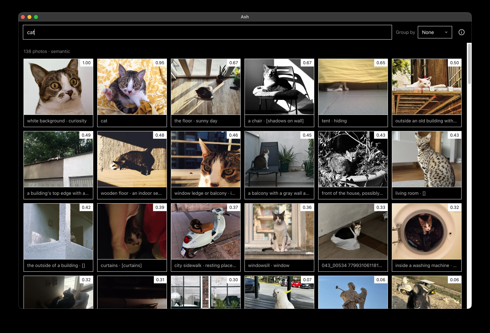

# Ash

**Search your photos by what's actually in them — completely offline.**

</div>

Drop a folder of photos into Ash and it describes each one, then lets you search them the way you'd search anything else: "dogs at the beach," "kitchen," "that trip to the coast." It also finds the connections between photos — the same place, the same object, the same kind of scene — so you can explore your library instead of endlessly scrolling it.



Your photos **never leave your computer.** Nothing is uploaded, there's no account, and no internet is required. Ash stores only a text description and the file's location — your original photos stay exactly where they are.

---

## What you can do

- **Search in plain language.** Type what you remember and Ash finds matching photos using their descriptions.
- **Filter precisely.** Narrow by `location`, `scene`, `object`, `tag`, `city`, `country`, or date — start typing a field and pick a value to add a removable filter chip. Anything left over runs a search alongside the filters.
- **Find photos by where they were taken.** If a photo has GPS data, Ash extracts the city, region, and country offline and folds it into search. "budva beach" finds photos taken in Budva that match "beach" — no maps API, no network.
- **Browse by theme.** Photos automatically group into Animals, Places, Objects, and Scenes, plus the people and things that show up again and again.
- **Follow the connections.** Open any photo to see its full description, its attributes, and other photos that are visually or contextually related.
- **Drag and drop to add photos.** Watch each one get scanned with live thumbnails, spinners, and a progress indicator.

---

## Get started

You'll need [Node 18 or newer](https://nodejs.org). Ash runs on **macOS, Windows, and Linux**, and installs `uv` automatically if you don't already have it.

One command installs everything and launches the app:

```bash
npm run setup       # macOS / Linux
npm run setup:win   # Windows (PowerShell)
```

On the first run, Ash:

1. Explains what it does and doesn't do — your photos stay local, no account, no tracking, no network.
2. Downloads the AI models it needs from HuggingFace (about 3.5 GB, one time only). On Intel or low-memory machines, it warns you first that things will be slower.

After that, drag in some photos and start searching. Next time, just run:

```bash
npm start
```

> 💡 **A graphics card helps a lot but isn't required.** See [Hardware](#hardware) below for what to expect on your machine.

---

## Privacy

This is the whole point of Ash: everything happens on your own computer. Describing photos, generating search, finding connections — all of it runs locally using AI models on your machine. No account, no API keys, no network calls.

Photos are **never copied or uploaded.** Ash stores only a description and the file path; the photos themselves stay in their original location.

---

## Hardware

| Your setup | What to expect |
|---|---|
| **Apple Silicon (M1–M4)** | Runs on the GPU via Metal with zero config. A base 8 GB M1 handles the bundled models fine; 16 GB is comfortable. |
| **Intel Macs** | CPU-only — describing a photo can take a minute or more. Fine for small libraries, slow for bulk imports. |
| **Windows / Linux** | CPU by default — fine for small libraries. For speed, drop a CUDA or Vulkan `llama.cpp` build into `vendor/bin`. |
| **Memory** | 8 GB is the practical minimum. Below that, importing may stall. |

---

## Changelog

### 1.1 — 2026-06-18

- **Security & correctness hardening + graph-augmented search** (Damir Krstanovic, [#5](https://github.com/Arsenije/Ash/pull/5)) — gates the sidecar HTTP API with a per-session token, adds a strict Content-Security-Policy to the renderer, and verifies model-download completeness so a dropped connection can't leave a truncated model file. Search now shows a relative-match bar with an opt-in relevance floor (default `0.5`) and folds khora's entity graph into ranking, surfacing connected photos that matched weakly on their own.
- **Offline GPS reverse geocoding** (Aleksandar Ristic, [#4](https://github.com/Arsenije/Ash/pull/4)) — extracts GPS coordinates from photo EXIF at ingest and reverse-geocodes them fully offline (local GeoNames dataset + `pycountry`), so you can search, filter, and group photos by city and country. The detail view shows a readable place name (e.g. "Budva, Montenegro, ME") instead of raw coordinates. Photos without GPS data are unaffected.

---

## How it works (for the curious)

Ash runs entirely on your machine. The pipeline looks like this:

```
Electron (UI)  ⇄  Python sidecar (FastAPI)  ⇄  khora (embedded)  →  llama-swap → llama.cpp (local GGUF models)
```

- **Electron app** (`electron/`, `renderer/`) — the interface: drag-and-drop, the search bar, the Themes view, and the detail view. It also manages the local runtime, downloading the model files and running `llama-swap`.
- **Python sidecar** (`sidecar/`) — a FastAPI service that calls a local vision model to describe each photo, then stores everything through [khora](https://github.com/DeytaHQ/khora).
- **[llama.cpp](https://github.com/ggml-org/llama.cpp) + [llama-swap](https://github.com/mostlygeek/llama-swap)** — `llama-server` runs the models; `llama-swap` puts a single OpenAI-compatible endpoint in front of them and swaps models on demand (vision, embeddings, text).
- **[khora](https://github.com/DeytaHQ/khora), embedded** — a `sqlite_lance` backend with a `vectorcypher` engine: SQLite + LanceDB running in-process. No Docker, no external services. Its entity extraction and resolution are what produce the cross-photo connections, without needing something like Neo4j.

Three local models do the work, all downloaded once (~3.5 GB): **SmolVLM2 2.2B** for vision (plus its mmproj projector), **Nomic Embed v1.5** for embeddings, and **Qwen2.5 3B** for entity extraction. The OpenAI SDK is used only as the HTTP client for the local endpoint — there's no key and no account.

<details>
<summary>Run the setup steps by hand</summary>

```bash
npm run binaries                                        # llama.cpp + llama-swap for this OS/arch
cd sidecar && uv venv --python 3.13 .venv \             # python sidecar
  && uv pip install --python .venv/bin/python "khora[embedded]" fastapi "uvicorn[standard]" openai pillow python-multipart reverse_geocoder pycountry && cd ..
npm install                                             # electron deps
npm start                                               # run
```

The app finds the runtime binaries in `vendor/bin/` (populated by `npm run binaries`), or in a packaged bundle's `Resources/bin/`.
</details>
